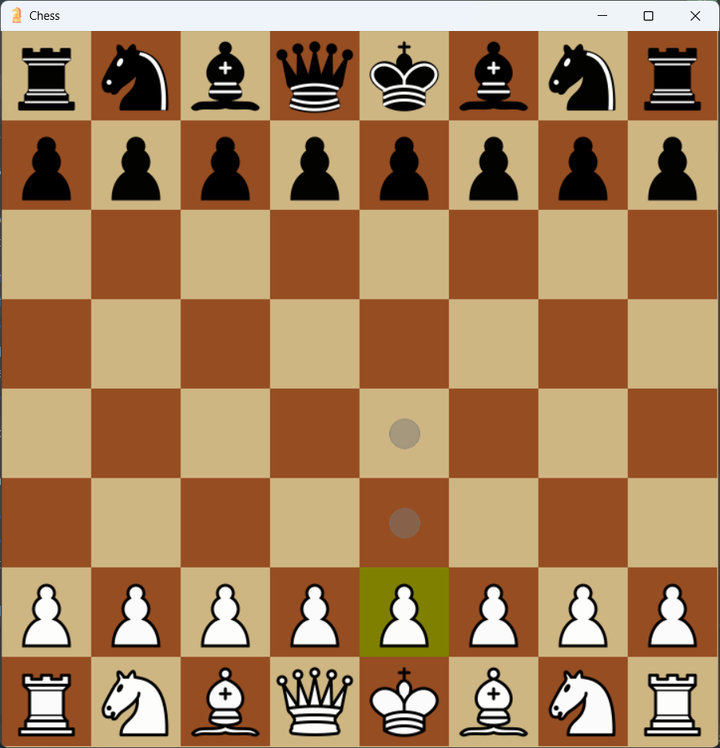

# Python Chess Bot 🧠♟️

A robust **Chess Bot** built in Python, capable of playing at an ~1800 Elo strength. It runs by executing the `Chess.py` file.

### Features:
- **Engine Strength:** ~1800 Elo
- **Algorithm:** Implements the [Minimax Algorithm with Alpha-Beta Pruning](https://www.chessprogramming.org/Alpha-Beta) to evaluate moves efficiently.
- **Depth Search:** Searches to a base depth of 4, with additional [Quiescence Search](https://www.chessprogramming.org/Quiescence_Search) on leaf nodes to avoid evaluating "active" positions inaccurately.
- **Game Modes Supported:**
  - Player vs Player
  - Engine vs Engine
  - Player vs Engine

### Move Generation Verification:
The move generation is rigorously tested and verified against [Perft](https://www.chessprogramming.org/Perft) results to ensure accuracy in positions and moves.

